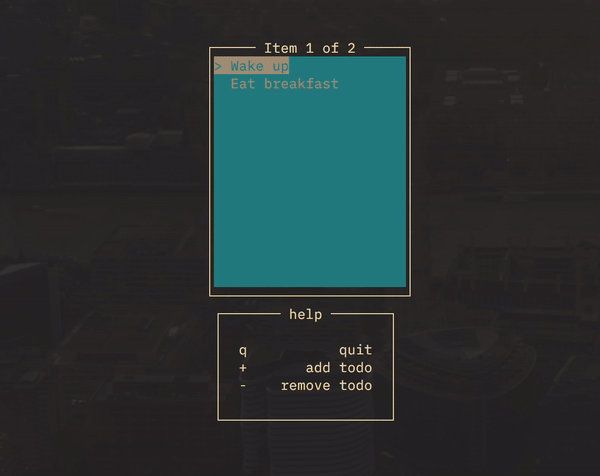

# Terminal todo app

A terminal interface for a very basic todo app

 

I was bored when I decided to make this. If you are interested in building terminal interfaces and functional programming however, check out [brick](https://hackage.haskell.org/package/brick), the library I used to build this.
